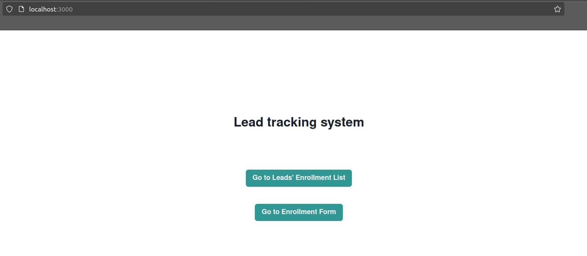
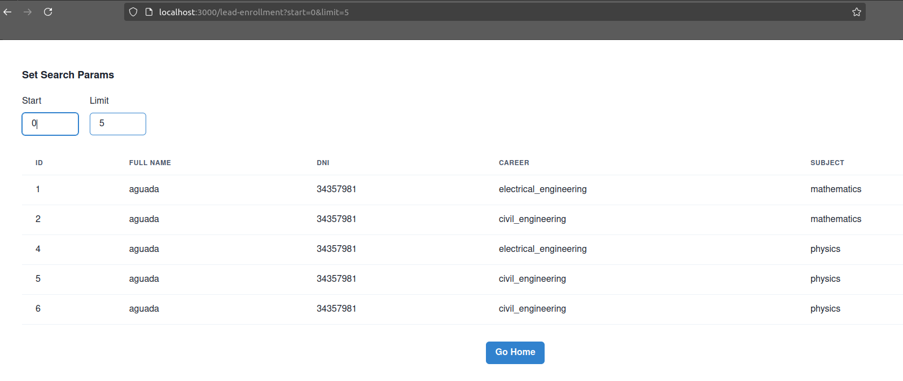
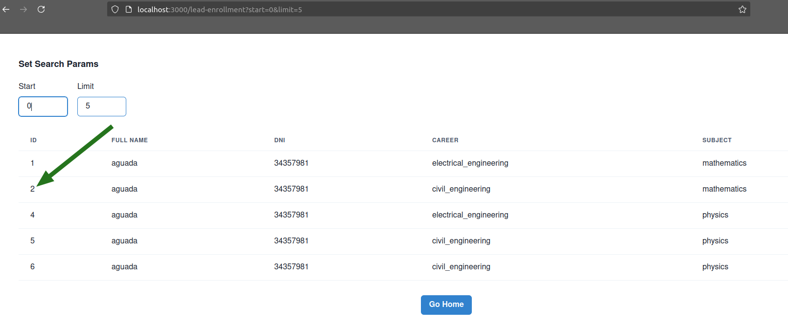
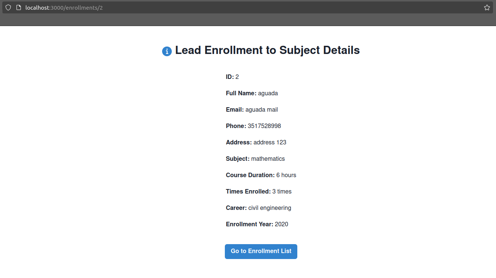
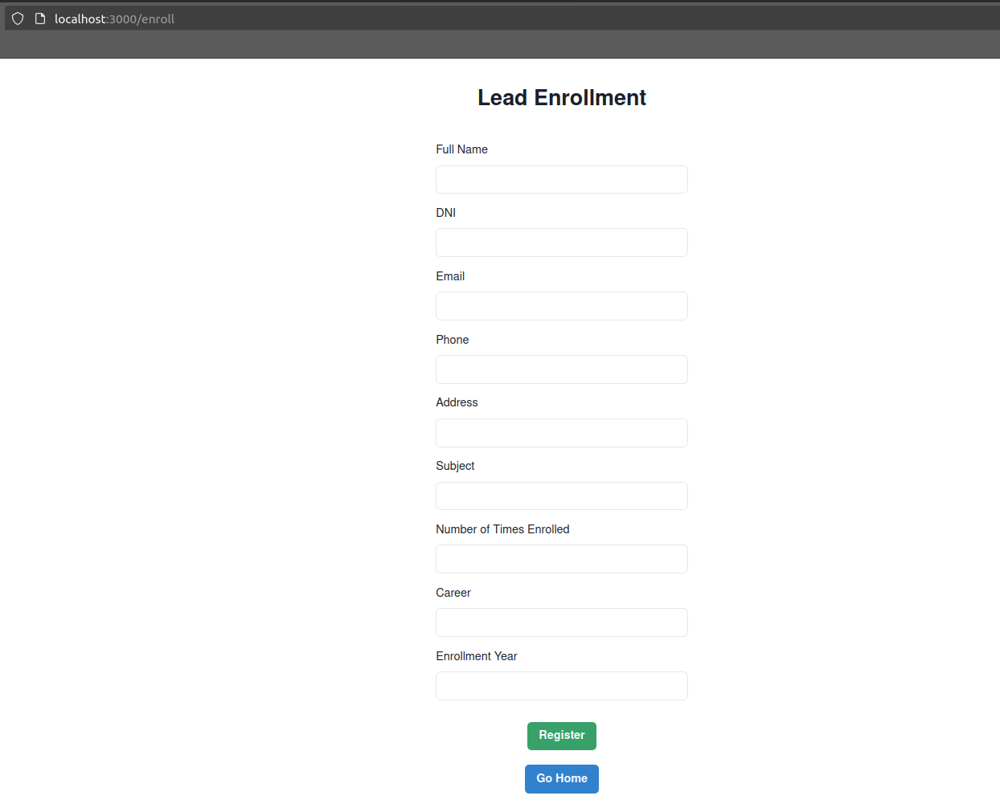
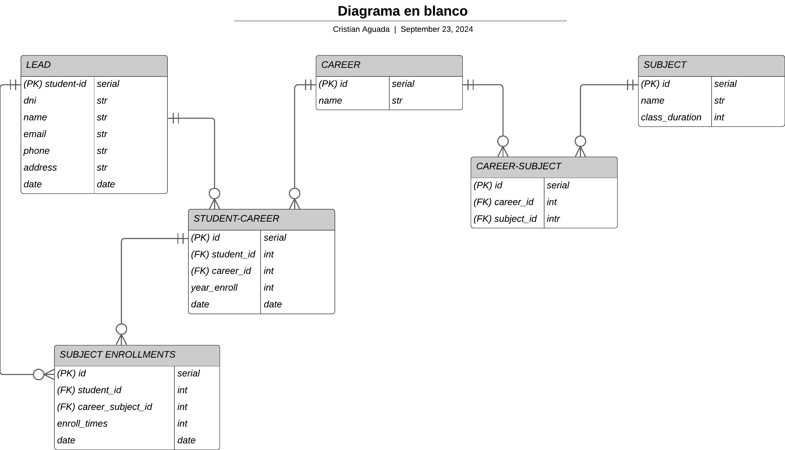

# FastApi-app project.

This is a **backend** application for managing the enrollment of leads in careers and subjects.
The **frontend** application is in **[this repository](https://github.com/AguadaC/fastApi-app-web)**.

## Functional Documentation

Information for the user.

### Overview

The goal of this project is to develop a registration process for leads, defined as individuals enrolled in subjects of various careers. The system must capture details about these individuals and the N subjects they are pursuing across multiple careers, where N can range from 0 to X.

This project aims to efficiently manage the registration of students and their enrollments, providing a seamless experience for users while ensuring data persistence through a robust PostgreSQL database.

### Functional Requirements

#### Lead Registration
- The system must support the registration of leads, defined as individuals enrolled in subjects within various careers.
- Each lead must be able to register multiple subjects (N subjects) across one or more careers (N careers), where N can range from 0 to X.

#### Data Validation:

- The API must validate the input fields required for lead registration, which include:
  - Full name
  - Email
  - Address
  - Phone number
  - Subject name
  - Duration of the course
  - Career name
  - Year of enrollment
  - Number of times the subject has been taken
- Upon successful registration of a lead, the system must provide confirmation along with the unique ID of the registered lead for traceability.

#### API Endpoints:

- A RESTful API must be implemented to handle lead registration and management.
- The API should provide endpoints to:
  - Create new leads.
  - Retrieve all registered leads in a paginated format.
  - Retrieve individual lead records by their unique ID.

#### Data Persistence:

- The system must use a relational database (preferably PostgreSQL) to store lead information and maintain data integrity.

#### Docker:

- The backend service must be containerized using Docker, facilitating easier deployment and management.

#### Documentation:

- The solution must be made available in a public Git repository (e.g., GitHub).
- Both functional and technical documentation should be included in the README of the repository, providing clear guidance on the API usage and system architecture.

### APIS Structure

The API is structured around a set of routers, each responsible for handling specific functionalities related to the management of leads, enrollments, and records. The following routers are included in the application:

- Root Router (/):
  - This serves as the entry point for the API, providing general information.

- Leads Router (/leads):
  - This router manages all operations related to leads. It allows for the creation of new leads, retrieval of all leads, and fetching individual leads by their unique identifiers.

- Enroll Router (/enroll):
  - The enroll router is dedicated to handling student enrollment in careers and subjects.

- Records Router (/records):
  - This router consolidates functionalities from both the leads and enroll routers. It enables the creation of complete records that encapsulate information about students, their enrolled careers, and subjects. Additionally, it supports pagination for retrieving all enrollment records and fetching specific records by ID. This is the MAIN router.

This structured approach allows for modularity and clarity in the API, ensuring that each group of routes addresses distinct aspects of lead and enrollment management while maintaining a cohesive overall framework.

#### Root Router (/)

- **Description:**
  This endpoint returns a welcome message that provides information about the application and available API endpoints.

- **HTTP Method:** 
  `GET`

- **Route:** 
  `/`

- **Parameters:**
  - **Required:**
    - None
  - **Optional:**
    - None

- **Example Request:**
  ```http
  GET / HTTP/1.1
  Host: 0.0.0.0:8000
  ```

  ```bash
  curl -X 'GET' \
  'http://0.0.0.0:8000/' \
  -H 'accept: application/json'
  ```

- **Example Response:**
  ```json
  {
    "title": "You have reached out to the App",
    "detail": "This application allows you to register leads and manage enrollments. For more information about available API endpoints, visit /docs endpoint.",
    "docs": "http://0.0.0.0:8000/docs"
  }
  ```

- **Response Model:**
  The response conforms to the `WelcomeModel`, which includes:
  - `title`: A string providing the title of the message.
  - `detail`: A string detailing the functionality of the application.
  - `docs`: A string containing the URL to the API documentation.

#### Leads Router (/leads):

- **Description:**
  The Leads API allows for the management of student leads, including creating new leads and retrieving existing leads from the database.

##### Create Lead

- **HTTP Method:** 
  `POST`

- **Route:** 
  `/leads/`

- **Parameters:**
  - **Required:**
    - `lead` (body): An instance of `CreateLeadModel` containing:
      - `dni`: The student's DNI (identity document number).
      - `name`: The student's full name.
      - `email`: The student's email address.
      - `phone`: The student's phone number.
      - `address`: The student's address.
  - **Optional:**
    - None

- **Example Request:**
  ```http
  POST /leads/ HTTP/1.1
  Host: 0.0.0.0:8000
  Content-Type: application/json

  {
    "dni": "12345678",
    "name": "John Doe",
    "email": "john.doe@example.com",
    "phone": "123-456-7890",
    "address": "123 Main St"
  }
  ```

- **Example Response:**
  ```json
  {
    "student_id": 1
  }
  ```

- **Response Model:**
  The response conforms to the `ResponseLeadId`, which includes:
  - `student_id`: The ID of the created lead.

- **Errors Raised:**
  - `StudentAlreadyExists`: If a student with the provided DNI already exists.

- **Flow of information**

Let's suppose that each piece of information has a valid type.

- The student's existence is validated by his or her DNI. If the DNI is in the database an [exception](#exceptions-and-status-codes) will be raised.
- If no exception is triggered the student will be created.

##### Get All Leads

- **HTTP Method:** 
  `GET`

- **Route:** 
  `/leads/`

- **Parameters:**
  - **Required:**
    - None
  - **Optional:**
    - None

- **Example Request:**
  ```http
  GET /leads/ HTTP/1.1
  Host: 0.0.0.0:8000
  ```

  ```bash
  curl -X 'GET' \
  'http://0.0.0.0:8000/leads/' \
  -H 'accept: application/json'
  ```

- **Example Response:**
  ```json
  [
    {
      "student_id": 1,
      "dni": "12345678",
      "name": "John Doe",
      "email": "john.doe@example.com",
      "phone": "123-456-7890",
      "address": "123 Main St"
    },
    {
      "student_id": 2,
      "dni": "87654321",
      "name": "Jane Smith",
      "email": "jane.smith@example.com",
      "phone": "098-765-4321",
      "address": "456 Elm St"
    }
  ]
  ```

- **Response Model:**
  The response conforms to a list of `ResponseLead`, which includes:
  - `student_id`: The ID of the student.
  - `dni`: The DNI of the student.
  - `name`: The name of the student.
  - `email`: The email of the student.
  - `phone`: The phone number of the student.
  - `address`: The address of the student.

##### Get Lead by ID

- **HTTP Method:** 
  `GET`

- **Route:** 
  `/leads/{register_id}`

- **Parameters:**
  - **Required:**
    - `register_id` (path): The ID of the lead to retrieve. Must be greater than 0.
  - **Optional:**
    - None

- **Example Request:**
  ```http
  GET /leads/1 HTTP/1.1
  Host: 0.0.0.0:8000
  ```

  ```bash
  curl -X 'GET' \
  'http://0.0.0.0:8000/leads/1' \
  -H 'accept: application/json'
  ```

- **Example Response:**
  ```json
  {
    "student_id": 1,
    "dni": "12345678",
    "name": "John Doe",
    "email": "john.doe@example.com",
    "phone": "123-456-7890",
    "address": "123 Main St"
  }
  ```

- **Response Model:**
  The response conforms to the `ResponseLead`, which includes:
  - `student_id`: The ID of the student.
  - `dni`: The DNI of the student.
  - `name`: The name of the student.
  - `email`: The email of the student.
  - `phone`: The phone number of the student.
  - `address`: The address of the student.

#### Enroll Router (/enroll)

- **Description:**
  The Enroll API allows for the enrollment of students in specified careers and subjects. It handles the necessary data to link students with their respective academic paths.

##### Enroll Student in a Career

- **HTTP Method:** 
  `POST`

- **Route:** 
  `/enroll/career`

- **Parameters:**
  - **Required:**
    - `student_and_career` (body): An instance of `EnrollStudentToCareer` containing:
      - `student_dni`: The student's DNI (identity document number).
      - `career_name`: The name of the career in which to enroll the student.
      - `year_enroll`: The year of enrollment.
  - **Optional:**
    - None

- **Example Request:**
  ```http
  POST /enroll/career HTTP/1.1
  Host: 0.0.0.0:8000
  Content-Type: application/json

  {
    "student_dni": "12345678",
    "career_name": "Computer Science",
    "year_enroll": 2023
  }
  ```

- **Example Response:**
  ```json
  {
    "id": 1
  }
  ```

- **Response Model:**
  The response conforms to the `ResponseStudentCareer`, which includes:
  - `id`: The ID of the newly created student-career enrollment record.

- **Errors Raised:**
  - `StudentCareerEnroll`: If the student is already enrolled in the specified career.

- **Flow of information**

Let's suppose that each piece of information has a valid type.

- The student's existence is validated by his or her DNI. If the DNI is not in the database an [exception](#exceptions-and-status-codes) will be raised.
- The career's existence are validated by its name. If it does NOT exist, the process will trigger an [exception](#exceptions-and-status-codes).
- If the student is enrolled in the career an [exception](#exceptions-and-status-codes) will be triggered.
- If no exception is raised until this step, the student will be enrolled in the career.

##### Enroll Student in a Subject

- **HTTP Method:** 
  `POST`

- **Route:** 
  `/enroll/subject`

- **Parameters:**
  - **Required:**
    - `student_career_subject` (body): An instance of `EnrollStudentToSubject` containing:
      - `student_dni`: The student's DNI (identity document number).
      - `career_name`: The name of the career in which the student is enrolled.
      - `subject_name`: The name of the subject to enroll the student in.
      - `enroll_times`: The number of times the student has enrolled in the subject.
  - **Optional:**
    - None

- **Example Request:**
  ```http
  POST /enroll/subject HTTP/1.1
  Host: 0.0.0.0:8000
  Content-Type: application/json

  {
    "student_dni": "12345678",
    "career_name": "Computer Science",
    "subject_name": "Data Structures",
    "enroll_times": 2
  }
  ```

- **Example Response:**
  ```json
  {
    "id": 1
  }
  ```

- **Response Model:**
  The response conforms to the `ResponseSubjectEnroll`, which includes:
  - `id`: The ID of the newly created student-subject enrollment record.

- **Flow of information**

Let's suppose that each piece of information has a valid type.

- The student's existence is validated by his or her DNI. If the DNI is not in the database an [exception](#exceptions-and-status-codes) will be raised.
- The career and the subject's existence are validated by their names. If they do NOT exist, the process will trigger an [exception](#exceptions-and-status-codes).
- If the student is not enrolled in the career an [exception](#exceptions-and-status-codes) will be triggered.
- If the subject is not [related to the career](#data-pre-set-information), it will raise an [exception](#exceptions-and-status-codes).
- If no exception is triggered until this step, the student will be enrolled in the subject.


#### Records Router (/records)

- **Description:**
  The Record API is responsible for managing complete lead records. It allows for the creation, retrieval, and pagination of student enrollment records.

##### Load Complete Record

- **HTTP Method:** 
  `POST`

- **Route:** 
  `/records`

- **Parameters:**
  - **Required:**
    - `lead` (body): An instance of `AddLeadRecord` containing:
      - `dni`: The student's DNI (identity document number).
      - `name`: The student's name.
      - `email`: The student's email.
      - `phone`: The student's phone number.
      - `address`: The student's address.
      - `subject`: The subject to enroll the student in.
      - `enroll_times`: The number of times the student has enrolled in the subject.
      - `career`: The name of the career.
      - `year_enroll`: The year of enrollment.
  - **Optional:**
    - None

- **Example Request:**
  ```http
  POST /records HTTP/1.1
  Host: 0.0.0.0:8000
  Content-Type: application/json

  {
    "dni": "12345678",
    "name": "John Doe",
    "email": "john@example.com",
    "phone": "123456789",
    "address": "123 Main St",
    "subject": "Data Structures",
    "enroll_times": 1,
    "career": "Computer Science",
    "year_enroll": 2023
  }
  ```

- **Example Response:**
  ```json
  {
    "id": 1
  }
  ```

- **Response Model:**
  The response conforms to the `ResponseSubjectEnroll`, which includes:
  - `id`: The enrollment ID of the student in the subject.

- **Flow of information**

Let's suppose that each piece of information has a valid type.

- The student's existence is validated by his or her DNI. If they exist, the student's information in the database will be used to complete the record.
If the DNI is not in the database, a new student will be created, with the information entered.
- The career and the subject's existences are validated by their names. If they do NOT exist, the process will trigger an [exception](#exceptions-and-status-codes).
- If the student is not enrolled in the career, they will be enrolled automatically.
- If the subject is not [related to the career](#data-pre-set-information), it will raise an [exception](#exceptions-and-status-codes).
- If no exception is triggered until this step, the student will be enrolled in the subject.

##### Get Record by ID

- **HTTP Method:** 
  `GET`

- **Route:** 
  `/records/{record_id}`

- **Parameters:**
  - **Required:**
    - `record_id` (path): The ID of the lead record to retrieve. Must be greater than 0.
  - **Optional:**
    - None

- **Example Request:**
  ```http
  GET /records/1 HTTP/1.1
  Host: 0.0.0.0:8000
  ```

  ```bash
  curl -X 'GET' \
  'http://0.0.0.0:8000/records/1' \
  -H 'accept: application/json'
  ```

- **Example Response:**
  ```json
  {
    "dni": "12345678",
    "name": "John Doe",
    "email": "john@example.com",
    "phone": "123456789",
    "address": "123 Main St",
    "subject": "Data Structures",
    "enroll_times": 1,
    "career": "Computer Science",
    "year_enroll": 2023,
    "id": 1,
    "class_duration": 60
  }
  ```

- **Response Model:**
  The response conforms to the `RetriveLeadRecord`, which includes:
  - All fields from `AddLeadRecord` plus:
  - `id`: The ID of the lead record.
  - `class_duration`: The duration of the class.

##### Get All Records

- **HTTP Method:** 
  `GET`

- **Route:** 
  `/records`

- **Parameters:**
  - **Required:**
    - None
  - **Optional:**
    - `start` (query): The index to start fetching records from. Must be >= 0. Default is 0.
    - `limit` (query): The maximum number of records to return. Must be > 0. Default is 10.

- **Example Request:**
  ```http
  GET /records?start=0&limit=5 HTTP/1.1
  Host: 0.0.0.0:8000
  ```

  ```bash
  curl -X 'GET' \
  'http://0.0.0.0:8000/records/?start=0&limit=10' \
  -H 'accept: application/json'
  ```

- **Example Response:**
  ```json
  [
    {
      "dni": "12345678",
      "name": "John Doe",
      "email": "john@example.com",
      "phone": "123456789",
      "address": "123 Main St",
      "subject": "Data Structures",
      "enroll_times": 1,
      "career": "Computer Science",
      "year_enroll": 2023,
      "id": 1,
      "class_duration": 60
    },
    {
      "dni": "87654321",
      "name": "Jane Smith",
      "email": "jane@example.com",
      "phone": "987654321",
      "address": "456 Main St",
      "subject": "Algorithms",
      "enroll_times": 2,
      "career": "Computer Science",
      "year_enroll": 2022,
      "id": 2,
      "class_duration": 45
    }
  ]
  ```

- **Response Model:**
  The response is a list of instances of `RetriveLeadRecord`, each containing:
  - All fields from `AddLeadRecord` plus:
  - `id`: The ID of the lead record.
  - `class_duration`: The duration of the class.

#### Exceptions and Status Codes

This section outlines the exceptions that may be raised during the operation of the API. Each exception extends the base error class and provides specific error handling for various scenarios.

All exceptions are handled by FastApi exception handlers.

##### Exceptions with STATUS_CODE HTTP_303_SEE_OTHER

- BaseError:

    All custom exceptions in this API extend from BaseError. This class initializes with a default error message that can be overridden.

- StudentAlreadyExists (BaseError):

    This exception is raised when an attempt is made to create a new student record, but a student with the same identifier (DNI) already exists in the database.

- StudentDoesNotExist (BaseError):

    This exception occurs when a requested student ID does not exist in the database. It is used to ensure that operations referencing a student only proceed if the student is valid.

- StudentCareerEnroll (BaseError):

    Raised when a student is already enrolled in a specified career. This helps prevent duplicate enrollments and ensures that the enrollment process is valid.

- UnenrolledStudent (BaseError):

    This exception is thrown when operations are attempted on a student who is not enrolled in a career or subject. It helps to manage and validate student enrollments effectively.

- CareerDoesNotExist (BaseError):

    Raised when a requested career does not exist in the database. This ensures that only valid careers can be associated with student enrollments.

- SubjectDoesNotExist (BaseError):

    This exception is raised when a requested subject does not exist in the database. It is used to validate subject enrollments for students.

- CareerSubjectDoesNotExist (BaseError):

    Occurs when there is an attempt to enroll a student in a subject that is not associated with the specified career. This ensures that students can only enroll in relevant subjects.

- EnrollRecordDoesNotExist (BaseError):

    Raised when attempting to retrieve or manipulate an enrollment record that does not exist. It provides error handling for record-related operations.

##### Exceptions with STATUS_CODE HTTP_428_PRECONDITION_REQUIRED

- OSError:

    This exception is raised when a system-related error occurs, such as issues with file handling, network connectivity, or other operating system-related failures. It can be raised when the connection with the database is unreacheble.

##### Exceptions with STATUS_CODE HTTP_406_NOT_ACCEPTABLE

- RequestValidationError:

    This exception is raised when the request data sent to the API does not meet the expected validation criteria defined in the request models. It typically occurs when required fields are missing, fields contain invalid data types, or when the data fails any defined validation checks (such as value ranges or formats)

##### Exceptions with STATUS_CODE HTTP_500_INTERNAL_SERVER_ERROR

- Exception:

    Any other type of exception not specifically covered in the previous cases will be handled as a basic Exception. This will return an HTTP status code of HTTP_500_INTERNAL_SERVER_ERROR along with details derived from the exception itself.

### Data Pre-Set Information

When utilizing the service APIs to enroll a student in a subject, the application requires three fundamental data points: the student's DNI, the name of the career, and the name of the subject. The application performs two key validations:

1- It verifies that the subject is associated with the career, effectively simulating a curriculum structure.

2- It checks that the student is enrolled in the career, thereby enabling enrollment in the subject.

Therefore, to create an enrollment, it is essential to adhere to the established relationship between careers and subjects.

- electrical_engineering

  - electronic_circuits
  - digital_systems
  - mathematics
  - physics
  - computer_science

- civil_engineering

  - structural_analysis
  - geotechnical_engineering
  - mathematics
  - physics
  - chemistry

- chemical_engineering

  - organic_chemistry
  - inorganic_chemistry
  - mathematics
  - chemistry
  - biology


### Quick Start

#### Pre-requirements

- Install `docker` and `docker-compose`. You can check [this official documentation](https://docs.docker.com/desktop/install/linux/ubuntu/).
- Download the frontend project.
- Go to the root directory of the frontend project.
- Build the frontend image with the tag **fastapi-web**
- Create the directory `/opt/challenge/data`:

```bash
sudo mkdir -p /opt/challenge/data
```

- Create the directory `/opt/challenge/logs`:

```bash
sudo mkdir -p /opt/challenge/logs
```

#### Steps

- Go to the root directory of the backend project.
- Run the Docker Compose:

```bash
docker-compose up --build
```

- Check that services are UP. You MUST to see the messages:

```bash
postgres_1       | 2024-09-25 13:57:38.616 UTC [1] LOG:  database system is ready to accept connections
.
.
challenge_1      | 2024-09-25 13:57:39,939 - Challenge - INFO - Unit version: 0.0.1.dev1
challenge_1      | 2024-09-25 13:57:39,940 - Challenge - INFO - Starting unit execution.
challenge_1      | INFO:     Application startup complete.
challenge_1      | INFO:     Uvicorn running on http://0.0.0.0:8000 (Press CTRL+C to quit)
.
.
challenge-web_1  |   Local:            http://localhost:3000
challenge-web_1  |   On Your Network:  http://172.18.0.4:3000
challenge-web_1  | 
challenge-web_1  | Note that the development build is not optimized.
challenge-web_1  | To create a production build, use npm run build.
challenge-web_1  | 
challenge-web_1  | webpack compiled successfully
challenge-web_1  | Compiling...
challenge-web_1  | Compiled successfully!
challenge-web_1  | webpack compiled successfully
```

#### Swagger

- In your browser, access to [http://0.0.0.0:8000/docs](http://0.0.0.0:8000/docs). This is the swagger page where you can test the available endpoints.

The view is this:


- Once there. Test the api what you want. [The APIS description is here](#apis-structure)

- Expand the API


- Click on `Try it Out`


- Complete the `Request body` con your test information. Execute the query and see the response.


- One example of these steps:


#### Web UI

- In your browser, access to [http://0.0.0.0:3000](http://0.0.0.0:3000). This is the web page where you can enroll leads, see all records using pagination and get the detail of each enrollment.

This is a view of the Homepage:



Here you can chose between see the enrollment records, or access to the enrollment form and load a lead with career and subject.

If you chose see the enrollment records:



Here, if you click on an ID, yo will access to the details of that enrollment record.





But if you. from the home page, click on the form enrollment, you will be able to load an lead with a career and subject.

.

There are two ways to enroll an lead, please read [this section]()


#### Stop services

- Press `CTRL + c` to stop the processes.


## Technical Documentation

To complement this documentation, read the [Functional Documentation](#functional-documentation).

### Database Structure

The database structure has been designed to efficiently manage information related to students, careers, and subjects. It employs a relational model that allows for the representation of relationships between different entities. Below is a detailed overview of the database architecture:

#### Main Entities

- Students: This table stores basic information about students, including a unique identifier (student_id), document number (dni), name, email, phone number, and address.

- Careers: This table contains the different careers available at the institution. Each career has a unique identifier (id) and a descriptive name.

- Subjects: This table holds the subjects offered within the careers. Each subject has a unique identifier (id), a name, and the class duration in hours.

#### Relationships Between Entities

The database employs several relationships to connect the entities:

Many-to-Many Relationship Between Students and Careers: The student_career table manages the relationship between students and careers, allowing a student to enroll in multiple careers and a career to have multiple students. This table includes student_id, career_id, and the enrollment year (year_enroll).

Many-to-Many Relationship Between Careers and Subjects: The career_subject table enables a career to be associated with multiple subjects and vice versa. It contains career_id and subject_id.

Many-to-Many Relationship Between Students and Subjects Through Careers: The subject_enrollments table connects students with specific subjects within their careers. It includes student_id, career_subject_id (a composite key for career and subject), and the number of times the student has enrolled in that subject (enroll_times).



#### Cascade behavior

There are specific cascading behaviors defined through foreign key constraints. These cascading actions ensure that when a record is deleted, all related records in other tables are also automatically removed, maintaining data integrity. Here’s how it works for each entity:

##### Deleting a Career

When a career is deleted from the careers table, the following actions occur:

  - Related Records in career_subject: All entries in the career_subject table that reference the deleted career will also be deleted. This ensures that there are no orphaned records that reference a career that no longer exists.

  - Related Records in student_career: Similarly, any records in the student_career table that link students to the deleted career will be removed.

##### Deleting a Student

When a student is deleted from the students table:

  - Related Records in student_career: All entries in the student_career table that associate the student with any career will be deleted, ensuring no student-career relationships remain for a non-existent student.

  - Related Records in subject_enrollments: Any records in the subject_enrollments table related to the deleted student will also be removed, preventing any enrollments from being left without an associated student.

##### Deleting a Subject

When a subject is deleted from the subjects table:

  - Related Records in career_subject: All records in the career_subject table that reference the deleted subject will be deleted, ensuring that there are no career-subject relationships for a non-existent subject.

  - Related Records in subject_enrollments: Any entries in the subject_enrollments table that involve the deleted subject will also be removed, maintaining the integrity of the enrollment data.

As said before in [pre-set information](#data-pre-set-information), this structure was used to simulate a similar behavior of a curriculum structure.

### System Architecture

#### Overview

The system architecture consists of a well-organized directory structure that separates concerns among configuration files, application logic, database management, testing, and resources. The challenge directory serves as the core of the FastAPI application, containing necessary configurations, models, API routes, and singleton classes to manage database connections and logging, ensuring a modular and maintainable codebase.

#### Root tree

```
root/
├── .dockerignore
├── .gitignore
├── docker-compose.yaml
├── Dockerfile
├── main.py
├── pyproject.toml
├── README.md
├── requirements-test.txt
├── requirements.txt
├── setup.py
├── tests/
├── resources/
├── postgres/
│   ├── Dockerfile
│   ├── initdb.sql
│   └── README.md
|
└── challenge/
    ├── version.py
    ├── settings.py
    ├── constants.py
    ├── exceptions.py
    ├── api/
    │   ├── api_enroll.py
    │   ├── api_records.py
    │   ├── api_root.py
    │   └── api_leads.py
    ├── core/
    │   ├── db_handler.py
    │   └── log_manager.py
    ├── models/
    │   ├── sql_models.py
    │   └── api_models.py
    └── utils/
        └── error_management.py
```

Functional Groups

  - Configuration and Setup Files
    - .dockerignore: Specifies files and directories to ignore when building a Docker image, helping to reduce the image size.

    - .gitignore: Lists files and directories that should be ignored by Git, preventing unnecessary files from being tracked.

    - docker-compose.yaml: Defines and manages the multi-container Docker application, specifying services, networks, and volumes.

    - Dockerfile: Contains instructions to build the Docker image for the application, including setting up the environment.

    - pyproject.toml: Configuration file for Python projects, specifying dependencies and project metadata.

    - requirements-test.txt: Lists dependencies required for testing the application.

    - requirements.txt: Contains the main dependencies required to run the application.

    -setup.py: Script for installing the application as a Python package.

  - Application Logic

    - main.py: The entry point of the FastAPI application, responsible for initializing and running the server.

  - Testing

    - tests/: Directory containing unit tests to ensure the functionality of the application is verified.

  - Resources

    - resources/: Stores images and other resources used in the README file.

  - Database Management

    - postgres/: Contains Dockerfiles and scripts needed to build the PostgreSQL image for the application.

  - Challenge Directory

    - challenge/: Main directory containing all necessary files for the FastAPI application.

      - version.py: Manages versioning of the application.

      - settings.py: Handles configuration variables, reading from environment variables.

      - constants.py: Defines constant values used throughout the application.

      - exceptions.py: Contains custom exception classes for handling errors and undesired outcomes.

    - Subdirectories in Challenge

      - api/: Contains files for each route created, with their respective methods and endpoints, facilitating the API structure of the application.
    
      - core/: Includes core functionalities, such as:

        - db_handler.py: Declares the DbHandler singleton class, which manages the database connection and query methods.

        - log_manager.py: Declares the LogManager singleton class for handling logging within the application.
    
      - models/: Contains models used in the application:

        - sql_models.py: Defines the database models for querying.

        - api_models.py: Defines request and response models used by the APIs.

      - utils/: Contains utility functions that support the application logic.

#### Environment variables

- REACT_APP_URL_BASE

  - Defines the base URL that the frontend application will use to make requests to the backend API.
  - Value: localhost:8000
  - Usage: This value is used in the React application code to construct the URLs for HTTP requests to the backend service.

- POSTGRES_HOST

  - Description: Specifies the host where the PostgreSQL database is located.
  - Value: postgres
  - Usage: This value allows the challenge service to connect to the PostgreSQL database using the service name defined in the docker-compose.yml file.

- POSTGRES_USER

  - Description: Defines the username for accessing the PostgreSQL database.
  - Value: postgres
  - Usage: This user is used to authenticate connections to the database and must have the necessary permissions to perform required operations by the application.

- POSTGRES_PASSWORD

  - Description: Specifies the password associated with the PostgreSQL user.
  - Value: postgres
  - Usage: This password is necessary to authenticate the user defined in POSTGRES_USER when attempting to connect to the database.

- POSTGRES_DB

  - Description: Indicates the name of the database to be used in PostgreSQL.
  - Value: challenge_db
  - Usage: This value is used to create and select the database that the application will use to store and retrieve data.

- POSTGRES_ECHO

  - Description: Allows enabling or disabling logging of SQL queries on the PostgreSQL server.
  - Value: 'true'
  - Usage: If set to 'true', all SQL queries executed by the application will be logged in the PostgreSQL server logs, which is useful for debugging and monitoring.

### How to Deploy

The deployment has 3 functional blocks:
- Frontend
- Backend
- Postgres database.

**Important**: You will need to download the frontend project from the mentioned link in the [beginning of this document](#fastapi-app-project), in the first overview.

#### FrontEnd

Once you download the frontend project, build the image with the tag **fastapi-web**. To do this, you can follow the steps in the frontend README.

#### BackEnd and database

The docker compose build automatically the backend project and the postgres database.

#### Steps
- Install `docker` and `docker-compose`. You can check [this official documentation](https://docs.docker.com/desktop/install/linux/ubuntu/).
- Download the frontend project.
- Go to the root directory of the frontend project.
- Build the frontend image with the tag **fastapi-web**
- Create the directory `/opt/challenge/data`:

```bash
sudo mkdir -p /opt/challenge/data
```

- Create the directory `/opt/challenge/logs`:

```bash
sudo mkdir -p /opt/challenge/logs
```

- Go to the root directory of the backend project.
- Run the Docker Compose:

```bash
docker-compose up --build
```

- Check that services are UP. You MUST to see the messages:

```bash
postgres_1       | 2024-09-25 13:57:38.616 UTC [1] LOG:  database system is ready to accept connections
.
.
challenge_1      | 2024-09-25 13:57:39,939 - Challenge - INFO - Unit version: 0.0.1.dev1
challenge_1      | 2024-09-25 13:57:39,940 - Challenge - INFO - Starting unit execution.
challenge_1      | INFO:     Application startup complete.
challenge_1      | INFO:     Uvicorn running on http://0.0.0.0:8000 (Press CTRL+C to quit)
.
.
challenge-web_1  |   Local:            http://localhost:3000
challenge-web_1  |   On Your Network:  http://172.18.0.4:3000
challenge-web_1  | 
challenge-web_1  | Note that the development build is not optimized.
challenge-web_1  | To create a production build, use npm run build.
challenge-web_1  | 
challenge-web_1  | webpack compiled successfully
challenge-web_1  | Compiling...
challenge-web_1  | Compiled successfully!
challenge-web_1  | webpack compiled successfully
```

- Press `CTRL + c` to stop the processes.


### Run test

- Go to the root directory of the backend project.
- Install requirements-test.txt

```bash
pip install -r requirements-test.txt
```

- Run pytest command:

```bash
pytest
```
