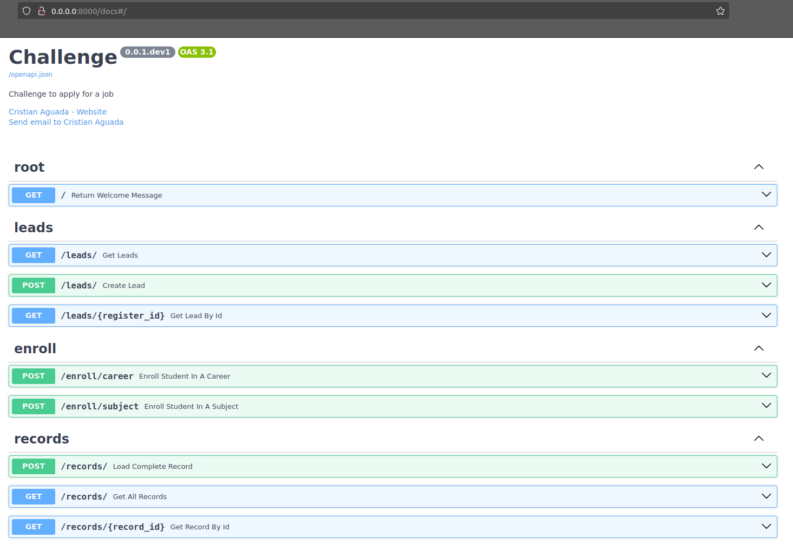
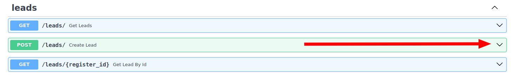
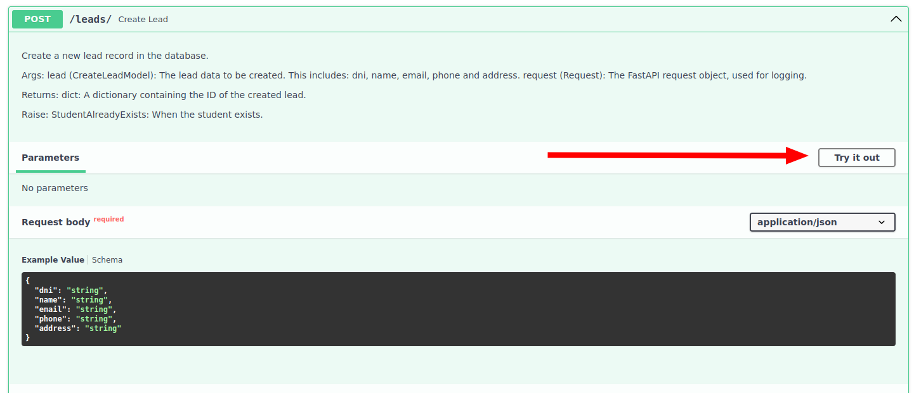
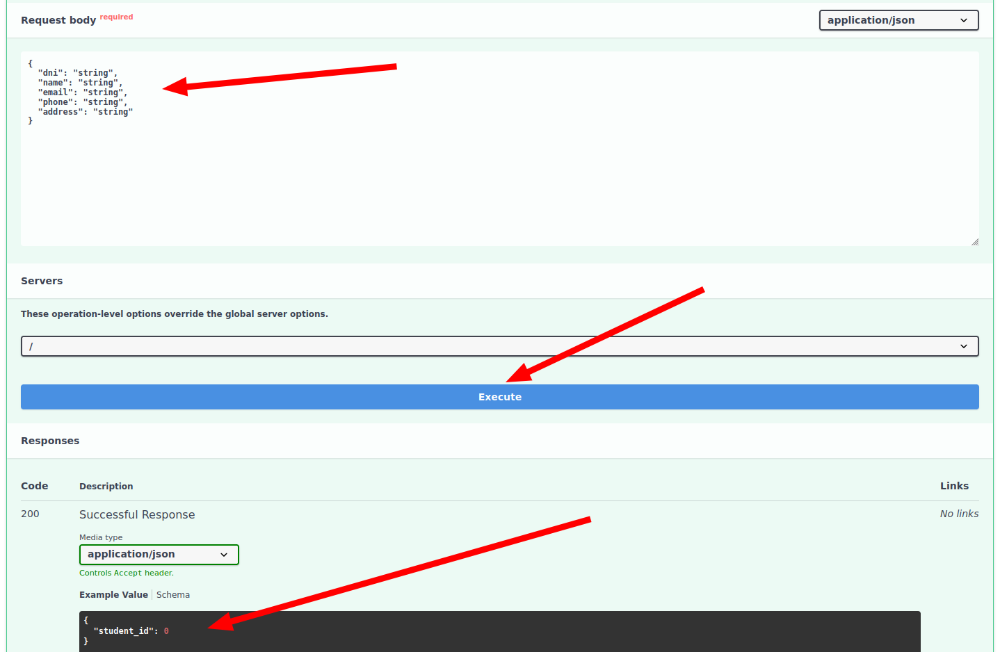
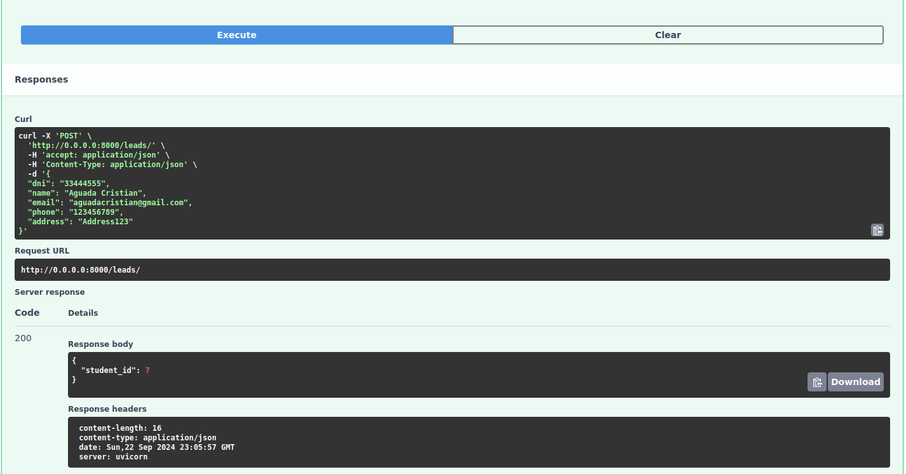

# FastApi-app project.

[TOC]

## Funcional Documentation

Information for the user.

### Overview

The goal of this project is to develop a registration process for leads, defined as individuals enrolled in subjects of various careers. The system must capture details about these individuals and the N subjects they are pursuing across multiple careers, where N can range from 0 to X.

This project aims to efficiently manage the registration of students and their enrollments, providing a seamless experience for users while ensuring data persistence through a robust PostgreSQL database.

### Functional Requirements

#### Lead Registration
- The system must support the registration of leads, defined as individuals enrolled in subjects within various careers.
- Each lead must be able to register multiple subjects (N subjects) across one or more careers (N careers), where N can range from 0 to X.

#### Data Validation:

- The API must validate the input fields required for lead registration, which include:
  - Full name
  - Email
  - Address
  - Phone number
  - Subject name
  - Duration of the course
  - Career name
  - Year of enrollment
  - Number of times the subject has been taken
- Upon successful registration of a lead, the system must provide confirmation along with the unique ID of the registered lead for traceability.

#### API Endpoints:

- A RESTful API must be implemented to handle lead registration and management.
- The API should provide endpoints to:
  - Create new leads.
  - Retrieve all registered leads in a paginated format.
  - Retrieve individual lead records by their unique ID.

#### Data Persistence:

- The system must use a relational database (preferably PostgreSQL) to store lead information and maintain data integrity.

#### Dockerization:

- The backend service must be containerized using Docker, facilitating easier deployment and management.

#### Documentation:

- The solution must be made available in a public Git repository (e.g., GitHub).
- Both functional and technical documentation should be included in the README of the repository, providing clear guidance on the API usage and system architecture.

### APIS Structure

The API is structured around a set of routers, each responsible for handling specific functionalities related to the management of leads, enrollments, and records. The following routers are included in the application:

- Root Router (/):
  - This serves as the entry point for the API, providing general information.

- Leads Router (/leads):
  - This router manages all operations related to leads. It allows for the creation of new leads, retrieval of all leads, and fetching individual leads by their unique identifiers.

- Enroll Router (/enroll):
  - The enroll router is dedicated to handling student enrollment in careers and subjects.

- Records Router (/records):
  - This router consolidates functionalities from both the leads and enroll routers. It enables the creation of complete records that encapsulate information about students, their enrolled careers, and subjects. Additionally, it supports pagination for retrieving all enrollment records and fetching specific records by ID. This is the MAIN router.

This structured approach allows for modularity and clarity in the API, ensuring that each group of routes addresses distinct aspects of lead and enrollment management while maintaining a cohesive overall framework.

#### Root Router (/)

- **Description:**
  This endpoint returns a welcome message that provides information about the application and available API endpoints.

- **HTTP Method:** 
  `GET`

- **Route:** 
  `/`

- **Parameters:**
  - **Required:**
    - None
  - **Optional:**
    - None

- **Example Request:**
  ```http
  GET / HTTP/1.1
  Host: 0.0.0.0:8000
  ```

  ```bash
  curl -X 'GET' \
  'http://0.0.0.0:8000/' \
  -H 'accept: application/json'
  ```

- **Example Response:**
  ```json
  {
    "title": "You have reached out to the App",
    "detail": "This application allows you to register leads and manage enrollments. For more information about available API endpoints, visit /docs endpoint.",
    "docs": "http://0.0.0.0:8000/docs"
  }
  ```

- **Response Model:**
  The response conforms to the `WelcomeModel`, which includes:
  - `title`: A string providing the title of the message.
  - `detail`: A string detailing the functionality of the application.
  - `docs`: A string containing the URL to the API documentation.

#### Leads Router (/leads):

- **Description:**
  The Leads API allows for the management of student leads, including creating new leads and retrieving existing leads from the database.

##### Create Lead

- **HTTP Method:** 
  `POST`

- **Route:** 
  `/leads/`

- **Parameters:**
  - **Required:**
    - `lead` (body): An instance of `CreateLeadModel` containing:
      - `dni`: The student's DNI (identity document number).
      - `name`: The student's full name.
      - `email`: The student's email address.
      - `phone`: The student's phone number.
      - `address`: The student's address.
  - **Optional:**
    - None

- **Example Request:**
  ```http
  POST /leads/ HTTP/1.1
  Host: 0.0.0.0:8000
  Content-Type: application/json

  {
    "dni": "12345678",
    "name": "John Doe",
    "email": "john.doe@example.com",
    "phone": "123-456-7890",
    "address": "123 Main St"
  }
  ```

- **Example Response:**
  ```json
  {
    "student_id": 1
  }
  ```

- **Response Model:**
  The response conforms to the `ResponseLeadId`, which includes:
  - `student_id`: The ID of the created lead.

- **Errors Raised:**
  - `StudentAlreadyExists`: If a student with the provided DNI already exists.

##### Get All Leads

- **HTTP Method:** 
  `GET`

- **Route:** 
  `/leads/`

- **Parameters:**
  - **Required:**
    - None
  - **Optional:**
    - None

- **Example Request:**
  ```http
  GET /leads/ HTTP/1.1
  Host: 0.0.0.0:8000
  ```

  ```bash
  curl -X 'GET' \
  'http://0.0.0.0:8000/leads/' \
  -H 'accept: application/json'
  ```

- **Example Response:**
  ```json
  [
    {
      "student_id": 1,
      "dni": "12345678",
      "name": "John Doe",
      "email": "john.doe@example.com",
      "phone": "123-456-7890",
      "address": "123 Main St"
    },
    {
      "student_id": 2,
      "dni": "87654321",
      "name": "Jane Smith",
      "email": "jane.smith@example.com",
      "phone": "098-765-4321",
      "address": "456 Elm St"
    }
  ]
  ```

- **Response Model:**
  The response conforms to a list of `ResponseLead`, which includes:
  - `student_id`: The ID of the student.
  - `dni`: The DNI of the student.
  - `name`: The name of the student.
  - `email`: The email of the student.
  - `phone`: The phone number of the student.
  - `address`: The address of the student.

##### Get Lead by ID

- **HTTP Method:** 
  `GET`

- **Route:** 
  `/leads/{register_id}`

- **Parameters:**
  - **Required:**
    - `register_id` (path): The ID of the lead to retrieve. Must be greater than 0.
  - **Optional:**
    - None

- **Example Request:**
  ```http
  GET /leads/1 HTTP/1.1
  Host: 0.0.0.0:8000
  ```

  ```bash
  curl -X 'GET' \
  'http://0.0.0.0:8000/leads/1' \
  -H 'accept: application/json'
  ```

- **Example Response:**
  ```json
  {
    "student_id": 1,
    "dni": "12345678",
    "name": "John Doe",
    "email": "john.doe@example.com",
    "phone": "123-456-7890",
    "address": "123 Main St"
  }
  ```

- **Response Model:**
  The response conforms to the `ResponseLead`, which includes:
  - `student_id`: The ID of the student.
  - `dni`: The DNI of the student.
  - `name`: The name of the student.
  - `email`: The email of the student.
  - `phone`: The phone number of the student.
  - `address`: The address of the student.

#### Enroll Router (/enroll)

- **Description:**
  The Enroll API allows for the enrollment of students in specified careers and subjects. It handles the necessary data to link students with their respective academic paths.

##### Enroll Student in a Career

- **HTTP Method:** 
  `POST`

- **Route:** 
  `/enroll/career`

- **Parameters:**
  - **Required:**
    - `student_and_career` (body): An instance of `EnrollStudentToCareer` containing:
      - `student_dni`: The student's DNI (identity document number).
      - `career_name`: The name of the career in which to enroll the student.
      - `year_enroll`: The year of enrollment.
  - **Optional:**
    - None

- **Example Request:**
  ```http
  POST /enroll/career HTTP/1.1
  Host: 0.0.0.0:8000
  Content-Type: application/json

  {
    "student_dni": "12345678",
    "career_name": "Computer Science",
    "year_enroll": 2023
  }
  ```

- **Example Response:**
  ```json
  {
    "id": 1
  }
  ```

- **Response Model:**
  The response conforms to the `ResponseStudentCareer`, which includes:
  - `id`: The ID of the newly created student-career enrollment record.

- **Errors Raised:**
  - `StudentCareerEnroll`: If the student is already enrolled in the specified career.

##### Enroll Student in a Subject

- **HTTP Method:** 
  `POST`

- **Route:** 
  `/enroll/subject`

- **Parameters:**
  - **Required:**
    - `student_career_subject` (body): An instance of `EnrollStudentToSubject` containing:
      - `student_dni`: The student's DNI (identity document number).
      - `career_name`: The name of the career in which the student is enrolled.
      - `subject_name`: The name of the subject to enroll the student in.
      - `enroll_times`: The number of times the student has enrolled in the subject.
  - **Optional:**
    - None

- **Example Request:**
  ```http
  POST /enroll/subject HTTP/1.1
  Host: 0.0.0.0:8000
  Content-Type: application/json

  {
    "student_dni": "12345678",
    "career_name": "Computer Science",
    "subject_name": "Data Structures",
    "enroll_times": 2
  }
  ```

- **Example Response:**
  ```json
  {
    "id": 1
  }
  ```

- **Response Model:**
  The response conforms to the `ResponseSubjectEnroll`, which includes:
  - `id`: The ID of the newly created student-subject enrollment record.


#### Records Router (/records)

- **Description:**
  The Record API is responsible for managing complete lead records. It allows for the creation, retrieval, and pagination of student enrollment records.

##### Load Complete Record

- **HTTP Method:** 
  `POST`

- **Route:** 
  `/records`

- **Parameters:**
  - **Required:**
    - `lead` (body): An instance of `AddLeadRecord` containing:
      - `dni`: The student's DNI (identity document number).
      - `name`: The student's name.
      - `email`: The student's email.
      - `phone`: The student's phone number.
      - `address`: The student's address.
      - `subject`: The subject to enroll the student in.
      - `enroll_times`: The number of times the student has enrolled in the subject.
      - `career`: The name of the career.
      - `year_enroll`: The year of enrollment.
  - **Optional:**
    - None

- **Example Request:**
  ```http
  POST /records HTTP/1.1
  Host: 0.0.0.0:8000
  Content-Type: application/json

  {
    "dni": "12345678",
    "name": "John Doe",
    "email": "john@example.com",
    "phone": "123456789",
    "address": "123 Main St",
    "subject": "Data Structures",
    "enroll_times": 1,
    "career": "Computer Science",
    "year_enroll": 2023
  }
  ```

- **Example Response:**
  ```json
  {
    "id": 1
  }
  ```

- **Response Model:**
  The response conforms to the `ResponseSubjectEnroll`, which includes:
  - `id`: The enrollment ID of the student in the subject.

##### Get Record by ID

- **HTTP Method:** 
  `GET`

- **Route:** 
  `/records/{record_id}`

- **Parameters:**
  - **Required:**
    - `record_id` (path): The ID of the lead record to retrieve. Must be greater than 0.
  - **Optional:**
    - None

- **Example Request:**
  ```http
  GET /records/1 HTTP/1.1
  Host: 0.0.0.0:8000
  ```

  ```bash
  curl -X 'GET' \
  'http://0.0.0.0:8000/records/1' \
  -H 'accept: application/json'
  ```

- **Example Response:**
  ```json
  {
    "dni": "12345678",
    "name": "John Doe",
    "email": "john@example.com",
    "phone": "123456789",
    "address": "123 Main St",
    "subject": "Data Structures",
    "enroll_times": 1,
    "career": "Computer Science",
    "year_enroll": 2023,
    "id": 1,
    "class_duration": 60
  }
  ```

- **Response Model:**
  The response conforms to the `RetriveLeadRecord`, which includes:
  - All fields from `AddLeadRecord` plus:
  - `id`: The ID of the lead record.
  - `class_duration`: The duration of the class.

##### Get All Records

- **HTTP Method:** 
  `GET`

- **Route:** 
  `/records`

- **Parameters:**
  - **Required:**
    - None
  - **Optional:**
    - `start` (query): The index to start fetching records from. Must be >= 0. Default is 0.
    - `limit` (query): The maximum number of records to return. Must be > 0. Default is 10.

- **Example Request:**
  ```http
  GET /records?start=0&limit=5 HTTP/1.1
  Host: 0.0.0.0:8000
  ```

  ```bash
  curl -X 'GET' \
  'http://0.0.0.0:8000/records/?start=0&limit=10' \
  -H 'accept: application/json'
  ```

- **Example Response:**
  ```json
  [
    {
      "dni": "12345678",
      "name": "John Doe",
      "email": "john@example.com",
      "phone": "123456789",
      "address": "123 Main St",
      "subject": "Data Structures",
      "enroll_times": 1,
      "career": "Computer Science",
      "year_enroll": 2023,
      "id": 1,
      "class_duration": 60
    },
    {
      "dni": "87654321",
      "name": "Jane Smith",
      "email": "jane@example.com",
      "phone": "987654321",
      "address": "456 Main St",
      "subject": "Algorithms",
      "enroll_times": 2,
      "career": "Computer Science",
      "year_enroll": 2022,
      "id": 2,
      "class_duration": 45
    }
  ]
  ```

- **Response Model:**
  The response is a list of instances of `RetriveLeadRecord`, each containing:
  - All fields from `AddLeadRecord` plus:
  - `id`: The ID of the lead record.
  - `class_duration`: The duration of the class.

#### Exceptions and Status Codes

This section outlines the exceptions that may be raised during the operation of the API. Each exception extends the base error class and provides specific error handling for various scenarios.

All exceptions are handled by FastApi exception handlers.

##### Exeptions with STATUS_CODE HTTP_303_SEE_OTHER

- BaseError:

    All custom exceptions in this API extend from BaseError. This class initializes with a default error message that can be overridden.

- StudentAlreadyExists (BaseError):

    This exception is raised when an attempt is made to create a new student record, but a student with the same identifier (DNI) already exists in the database.

- StudentDoesNotExist (BaseError):

    This exception occurs when a requested student ID does not exist in the database. It is used to ensure that operations referencing a student only proceed if the student is valid.

- StudentCareerEnroll (BaseError):

    Raised when a student is already enrolled in a specified career. This helps prevent duplicate enrollments and ensures that the enrollment process is valid.

- UnenrolledStudent (BaseError):

    This exception is thrown when operations are attempted on a student who is not enrolled in a career or subject. It helps to manage and validate student enrollments effectively.

- CareerDoesNotExist (BaseError):

    Raised when a requested career does not exist in the database. This ensures that only valid careers can be associated with student enrollments.

- SubjectDoesNotExist (BaseError):

    This exception is raised when a requested subject does not exist in the database. It is used to validate subject enrollments for students.

- CareerSubjectDoesNotExist (BaseError):

    Occurs when there is an attempt to enroll a student in a subject that is not associated with the specified career. This ensures that students can only enroll in relevant subjects.

- EnrollRecordDoesNotExist (BaseError):

    Raised when attempting to retrieve or manipulate an enrollment record that does not exist. It provides error handling for record-related operations.

##### Exeptions with STATUS_CODE HTTP_428_PRECONDITION_REQUIRED

- OSError:

    This exception is raised when a system-related error occurs, such as issues with file handling, network connectivity, or other operating system-related failures. It can be raised when the connection with the database is unreacheble.

##### Exeptions with STATUS_CODE HTTP_406_NOT_ACCEPTABLE

- RequestValidationError:

    This exception is raised when the request data sent to the API does not meet the expected validation criteria defined in the request models. It typically occurs when required fields are missing, fields contain invalid data types, or when the data fails any defined validation checks (such as value ranges or formats)

##### Exeptions with STATUS_CODE HTTP_500_INTERNAL_SERVER_ERROR

- Exception:

    Any other type of exception not specifically covered in the previous cases will be handled as a basic Exception. This will return an HTTP status code of HTTP_500_INTERNAL_SERVER_ERROR along with details derived from the exception itself.


### Quick Start

#### Pre-requirements

1- Install `docker` and `docker-compose`. You can check [this oficial documentation](https://docs.docker.com/desktop/install/linux/ubuntu/).

2- Create the directories that you will need.

- `/opt/challenge/logs`
- `/opt/challenge/data`

#### Steps

1- Download the project.

2- Go to the project root path.

3- Run de docker-compose file.

```bash
docker-compose up --build
```

4- Verify the successful deployment of the units.
You have to see the following messages:

```
postgres_1   | 2024-09-22 22:12:51.726 UTC [1] LOG:  database system is ready to accept connections
.
.
.
challenge_1  | INFO:     Uvicorn running on http://0.0.0.0:8000 (Press CTRL+C to quit)
```

5- In your browser, access to [http://0.0.0.0:8000/docs](http://0.0.0.0:8000/docs). This is the swagger page where you can test the available endpoints.

The view is this:


6- Once there. Test the api what you want. [The APIS description is here](#apis-structure)

- Expand the API


- Click on `Try it Out`


- Complete the `Request body` con your test information. Execute the query and see the response.


- One example of these steps:

